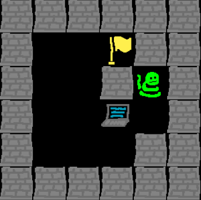
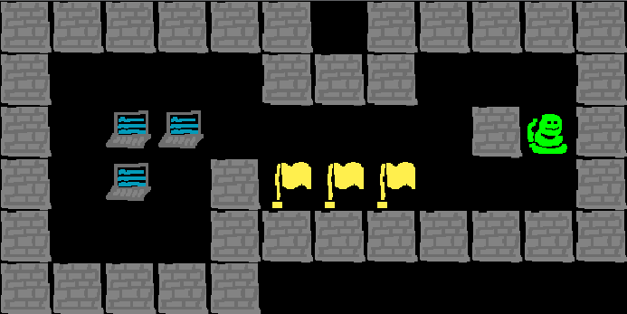
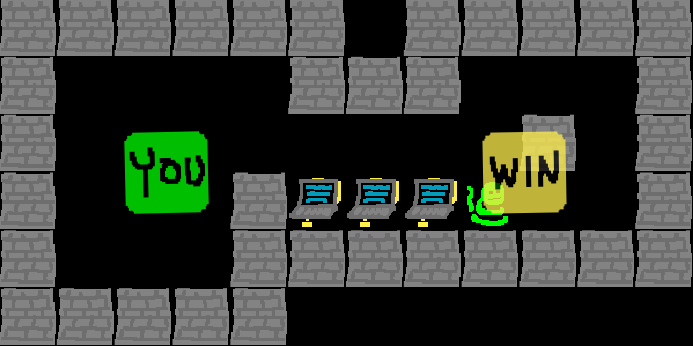

# 'Snekoban' game and solver
Recreation of 'Sokoban' game in Python that can be played and also has a solver. Completed for MIT 6.009 Spring 2022 lab.

## Gameplay
Snekoban description: The player controls a green snake character and the goal is to push computers around an environment with walls and barriers until every target (yellow flag) is covered with a computer. See gameplay screenshots at the bottom of the README.

To play, run `server.py`.

Game representation: I use a dictionary with keys-value pairs being game objects and their locations on the board. The dictionary also holds information about the game board such as its size.

## Solver
The solver returns a list of strings representing the shortest sequence of moves ("up", "down", "left", and "right") needed to reach the victory condition, if possible, given a starting configuration.

Uses a breadth-first-search with the pseudocode below:
```
initialize visited paths tracker, unvisited paths queue
while unvisited paths queue is not empty or victory state not achieved:
    pop one path from queue
    if terminal move leads to visited board, ignore this path
    if terminal move achieves victory state, end search and return path
    else
        add terminal board state to visited
        add each next viable, unvisited move set to q
```

## Screenshots
Example 1:




Gameplay screenshot, starting config:



Gameplay screenshot, victory state:


